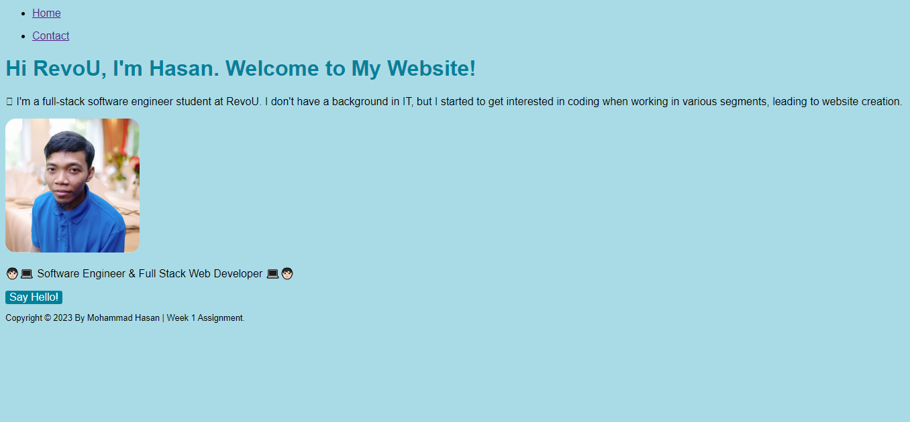

# **Weekly Assignment 1**

My first website

## **Basic Single Personal Branding Page**

This website is a simple personal branding made in HTML, CSS and Javascript with interaction features embedded in prompt alerts.

### **Here is a snapshot of the website's appearance :**

### **Deployment**

This website has been deployed using the Netlify platform. If you want to explore its contents, kindly access it by clicking on the hyperlink below:

👉[Click to View](https://mohammadhasan-weekly-w1.netlify.app/)

**Thank you for visiting**. It is my hope that you have a delightful experience during your visit.
